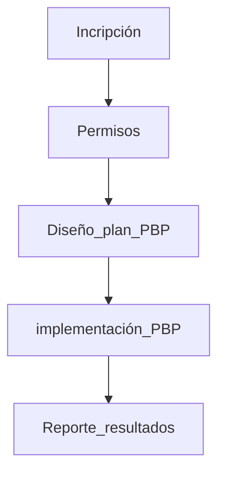

# Desafío 2026

## Con nuevas fechas!

# Convocatoria

La Seremi Energía Valparaíso invita a los establecimientos educacionales de enseñanza básica y media, en lo sucesivo establecimientos educacionales, de la región a participar del concurso estudiantil #energychallenge 26.

[Recuerda inscribir tu colegio aquí](https://tinyurl.com/ec-inscripcion)

[Energy Challenge Inscripción](https://tinyurl.com/ec-inscripcion)

<aside>
💡

El concurso busca capacitar sobre el uso eficiente de la energía y las energías renovables a la comunidad educativa de los establecimientos educacionales de la región.

</aside>

# Qué es y que hacemos

EnergyChallenge es un concurso estudiantil que busca inculcar el **buen uso de la energía** en todos los establecimientos de la región de Valparaíso, premiando a los colegios que logren mayor eficiencia energética en un cierto periodo de tiempo.

Para alcanzar la cima todo el colegio tiene que participar como un solo equipo, y los premios son la implementación de un set educativo para implementar un laboratorio de energía solar en el colegio.

# Auspiciadores

Este concurso se desarrolla gracias al esfuerzo conjunto entre el sector público y el sector privado, aportando un invaluable apoyo en:

- La coordinación de fabricación de los kits fotovoltaicos de laboratorio
- La capacitación de uso de los kits fotovoltaicos a los docentes del establecimiento educacional ganador.
- Mentores los cuales realizarán seguimiento y apoyo a los docentes contrapartes en los establecimientos educacionales participantes.El presente concurso cuenta con el apoyo de los siguientes auspiciadores (por orden de pronunciamiento):

Agradecemos profundamente la colaboración de los auspiciadores, ya que sin ellos, este concurso no sería posible.

# Premios

Para motivar a estudiantes y profesores , el concurso tiene fabulosos premios para el colegio, :  

## 🥇 1er Lugar

Laboratorio Solar Fotovoltaico de 3 módulos Educativos Solares.

## 🥈2do Lugar

 Mini Laboratorio Solar Fotovoltaico de 2 módulos solares Educativos

## 🏅Bono Territorial

Mini laboratorio Solar Fotovoltaico con 1 módulo solar si tu colegio competidor, no obtenga 1er o 2do lugar, y  pertenezca a las comunas de:

Petorca, Cabildo, La Ligua, Zapallar, Papudo y Viña del Mar con boleta CGE.

# Qué establecimientos pueden participar

Podrán participar en este concurso estudiantil regional, todos los establecimientos educacionales de la **Región de Valparaíso** que cuenten con educación básica, educación media y establecimientos que tengan ambos niveles de básica y media. Ya sean Colegios, Escuelas, Liceos,…

<aside>
💡

Como queremos beneficiar al máximo de participantes, no podrán participar aquellos establecimientos que hayan sido ganadores del 1er lugar en concursos Energy Challenge de años anteriores.

</aside>

# Periodos de evaluación energética

El presente concurso premiará al colegio con mayor ahorro energético entre los siguientes periodos:

## consumo base *

fecha referencial respecto a la cual se ponderará el ahorro:

<aside>
💡

🟨 desde **agosto de 2025** hasta **septiembre de 2025**

</aside>

El periodo a considerar corresponde a la periodo **de lectura** de su boleta de consumo eléctrico, y **no** a la fecha de facturación.

<aside>
⚠️

el “periodo de lectura” generalmente corresponder al mes anterior de la “fecha de facturación”. Es decir, para las lecturas de AGO’25 se deberán utilizar las boletas facturadas en SEP’25.

También se aceptarán como boletas AGOSTO las boletas con lectura 31/JUL*, ya que su lectura en mayor parte corresponde a los días de AGOSTO.

</aside>

## consumo de evaluación

fechas en que el establecimiento ejecutará acciones de ahorro:

<aside>
💡

🟩 desde AGOSTO **de 2026** hasta SEPTIEMBRE **de 2026**

</aside>

## Beneficio participantes antiguos🎉

**¿Qué pasa si mi colegio participó antes ejecutando acciones horro energético de #energychallenge anterior?**

¿Eso no afecta mi capacidad de ahorro energético del periodo actual?

### en corto… SI AFECTA

<aside>
🪙

Para solucionar esta  "desventaja", todos los establecimientos que participaron implementado un [**Plan de buenas prácticas**](https://www.notion.so/Plan-de-Buenas-Pr-cticas-1f4938ab020580058a22d4218d4e8f8c?pvs=21)  en #EnergyChallenge anteriores, pueden opcionalmente presentar como 🟨CONSUMO BASE los consumos eléctricos del año *inmediatamente* anterior o el año *inmediatamente* posterior a dicho periodo de implementación del **#[Plan de buenas prácticas](https://www.notion.so/Plan-de-Buenas-Pr-cticas-1f4938ab020580058a22d4218d4e8f8c?pvs=21)** 

</aside>

Explicado en simple, si su establecimiento participó y ejecutó un  [**Plan de buenas prácticas**](https://www.notion.so/Plan-de-Buenas-Pr-cticas-1f4938ab020580058a22d4218d4e8f8c?pvs=21)  #EC el año 2025, puede presentar los consumos base 2024 o una boleta previa donde no haya implementado dicho plan. 

Veamos este otro caso de ejemplo:

| versión #ec | participa en el 
concurso del año X | ¿implementa 
un plan ese año X? | ¿me conviene el consumo año X como base? |
| --- | --- | --- | --- |
| 2022 | ❌ | ❌ | ❌ no para nada |
| 2023 | ❌ | ❌ | ✅ si claro que sí |
| 2024 | ✅ | ✅ | ❌ no conviene para nada |
| 2025 | ✅ | ❌ | ✅ |

Si su establecimiento participó y ejecutó un  [**Plan de buenas prácticas**](https://www.notion.so/Plan-de-Buenas-Pr-cticas-1f4938ab020580058a22d4218d4e8f8c?pvs=21)  el #EC anteriores, puede presentar los consumos base cuando no participó o ganó el encuentro. Recuerda que tienes que respaldar dichos consumos con su correspondiente boleta eléctrica de dicho periodo. 

[ver listado participantes antiguos en el anexo](https://www.notion.so/Participantes-antiguos-1f4938ab020580728201d995aea28311?pvs=21)

# Fases del concurso

El concurso cuenta con 4 fases, los cuales los participantes deben cumplir a cabalidad.

## Ganadores

Los Ganadores del presente concurso se seleccionarán a partir del ranking la diferencia porcentual del consumo energético del periodo base y el periodo de evaluación, en orden descendiente, con respecto a la siguiente formula.

$$
ahorro[\%] = \frac{Consumo_{base} - Consumo_{actual}}{Consumo_{base}}*100
$$

<aside>
⚠️

Serán considerados candidatos válidos al podio de ganadores solamente los ahorros calculados mayores a cero, ya que valores negativos implican incremento del consumo, y quedarán descalificados.

</aside>

En el caso de “empate técnico” se utilizará todos los decimales necesarios de la fórmula para dirimir y establecer los ganadores. **¡cada miliwatt cuenta!**

# Etapas y plazos:

Se estipulan los siguientes plazos de inscripción y su respectivos links.  Si la fecha cae fin de semana o feriados, se corre el plazo límite al siguiente día hábil, manteniendo la misma hora correspondiente:

| **fecha** | **hora** | etapa | enlace | id |
| --- | --- | --- | --- | --- |
| 08 jun 2026 | 10:00 | lanzamiento |  |  |
| 29 jun 2026 | 23:59 | plazo consultas | [click aquí](mailto:EnergiaValpo@minenergia.cl?subject=#ec25%20%20consulta%20bases%20del%20concurso) | nueva fecha! |
| 10 jul 2026 | 23:59 | plazo inscripción | [click aquí](https://tinyurl.com/ec-inscripcion) | ✍️nueva fecha! |
|  31 jul 2026 | 16:00 | capacitación Plan de Buenas Prácticas | se enviará por correo |  |
| 31 jul 2026 | 23:59 | plazo firma autorización | link al correo | ✍️ |
| 31 jul 2026 | 23:59 | entrega de Plan de Buenas Prácticas | link al correo | 🧠 |
| Agosto+
Septiembre |  | implementación del Plan de Buenas Prácticas |  | ⚡ |
| 31 oct 2026 | 23:59 | reporte de consumos | link al correo |  |
| 4 nov 2026 | 12:00 | publicación de ganadores |  | 🏆 |
| 11,12,13 nov 2026 | 12:00 | premiación ganadores |  |  |

# Criterios de evaluación

Estos son los principales criterios para validación de participantes en cada fase

- Fase inscripción
    - Entrega de información completa previo plazo.
    - Entrega de la autorización del director de la institución.
    - Entrega de información correcta y con su verificación.
    - Verificación de participación anterior
- Fase diseño de plan de buenas prácticas PBP
    - Entrega oportuna del Plan de Buenas Prácticas PBP mediante los medios estipulados.
- Fase de ahorro energético
    - Ranking de posición por [[#Ganadores|ahorro energético]].
    - Validación de ahorros positivos.
    - Validación por decimal en caso de empates técnicos.

# Reserva de derechos

La SEREMI de Energía se reserva el derecho a:

1. Revocar el presente concurso llamado a convocatoria hasta el plazo de 120 días desde la fecha de lanzamiento del concurso , ya sea por fuerza mayor o caso fortuito, mediante comunicación pública al efecto.
2. Modificar las presentes bases en cualquier momento, antes de finalizar la fase dos, ya sea por iniciativa propia o en atención a una aclaración o consulta. La Organización evaluará las condiciones de aplicación de las modificaciones, considerando la naturaleza de estas, para ajustar los plazos de presentación si la situación lo amerita.

<aside>
💡

Dichas modificaciones serán obligatorias para todos los participantes y serán publicadas oportunamente.

</aside>

# Difusión 🔊

- La difusión del concurso se realizará mediante redes sociales, charlas de difusión en las provincias continentales de la región de Valparaíso y/o prensa.
- La institución ganadora del primer lugar será premiada en una ceremonia en su mismo establecimiento educacional.
- Los resultados serán exhibidos en redes sociales de las instituciones participantes organizadoras o colaboradoras, así como también en otros medios de comunicación escritos y/o digitales.
    - [Oficial Energía Valpo Facebook](https://www.facebook.com/EnergiaValpo/)
    - [Oficial Energía Valpo Instagram](https://www.instagram.com/energiavalpo/)
- Por otra parte, se señala que los datos entregados por las instituciones participantes serán utilizados exclusivamente para efectos de análisis y estudio de la SEREMI de Energía.

# Anexos

[ **Plan de Buenas Prácticas**](https://www.notion.so/Plan-de-Buenas-Pr-cticas-1f4938ab020580058a22d4218d4e8f8c?pvs=21)

[Participantes antiguos](https://www.notion.so/Participantes-antiguos-1f4938ab020580728201d995aea28311?pvs=21)

[Enlaces al concurso](https://www.notion.so/Enlaces-al-concurso-1f4938ab020580619a0ad55870977d1f?pvs=21)

## 🎧Temas musicales

La motivación es lo primordial para EnergyChallenge. Es por eso que hemos preparado playlist oficial de alto octanaje para promover el ahorro en tu establecimiento.

### escucha el cover “Desafío de la Energía”

[https://suno.com/song/24b1487c-18d1-4abd-a585-f499e8014e5f](https://suno.com/song/24b1487c-18d1-4abd-a585-f499e8014e5f)

### escucha el álbum completo en #ecRadio

[Energy Challenge by @c_doodle_soul | Suno](https://suno.com/playlist/120047db-7904-4e6a-b25d-a4b885a57bae)